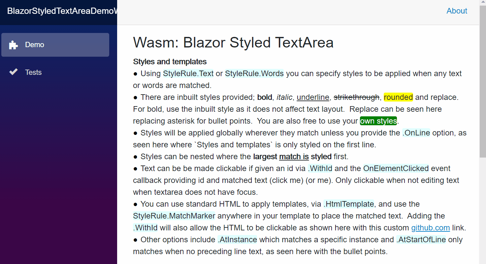
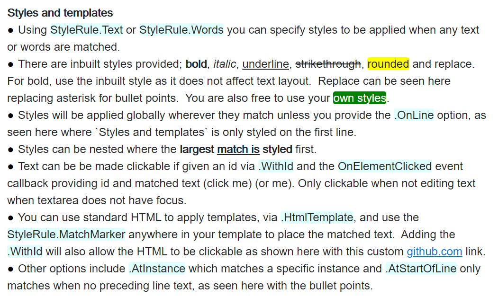
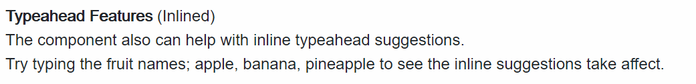
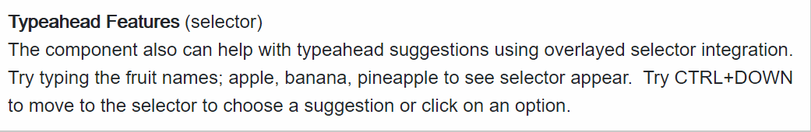

# BlazorStyledTextArea
A textarea with style!

### Important
As an early adopter use only for own projects where you are happy to provide feedback and improve this component, resolving any early use issues.  Please do not use for company or enterprise applications until this has been shared and used by a good sample of developers.

## What it does?
This component essentially remains and works as a textarea but can have any of the text styled based on your application needs.  Its simplicity is purposefully designed to avoid the complexities and issues that come with rich text editors. 

It provides simple styling rules and efficient handling of line changes, along with inline typeahead features and ability to add your own custom overlayed typeahead selector or other contextual elements. 

It does not provide the full support of markup editing and user interaction that rich text editors bring but does provide the styling needs that would be required by most plain text applications.



[Online Demo](https://salmon-grass-0281f5503.1.azurestaticapps.net/)

## Feature Summary
* Simple to use 
* Composable rules
* Smooth user experience
* Interaction with styles
* Efficient line changes
* Typeahead ability
* Caret data exposed

## Installation
Latest version in here:  [](https://www.nuget.org/packages/BlazorStyledTextArea/)

```
Install-Package BlazorStyledTextArea
```
or 
```
dotnet add package BlazorStyledTextArea
```

## The API
```html
<StyledTextArea
    @bind-Value=myText
    @bind-Value:event='oninput'
    StyleRules=myStyleRules
    OnLinesChanged=myOnLinesChangedCallback
    TypeaheadReservedKeys=myTypeaheadReservedKeys
    OnCalculateTypeahead=myOnCalculateTypeaheadCallback
    OnKeyDown=myOnKeyDownCallback
    OnCaretChanged=myOnCaretChangedCallback
    OnElementClicked=MyElementClicked
    TimeElementIsClickableInMilliseconds=1200
    UseStandardTextarea=false>
    <InlineTypeahead>
      style your typeahead text suggestion here
    </InlineTypeahead>
    <CustomTypeahead>
      style your typeahead dropdown selector here
    </CustomTypeahead>
</StyledTextArea>
```

### Parameters
* `Value` (`ValueChanged`) - bind your text string
* `StyleRules` - list of `StyleRule` to style text
* `OnLinesChanged` - callback `ChangedLines`
* `TypeaheadReservedKeys` - enumerable of `KeyboardEventArgs` used when typeahead has focus to avoid textarea receiving these keys presses.
* `OnCalculateTypeahead` - callback `CalculateTypeaheadEventData`
* `OnKeyDown` - callback `KeyboardEventArgs` used to toggle dropdown or accept typeahead or other uses
* `InlineTypeahead` - render fragment to show typeahead suggestion
* `CustomTypeahead` - render fragment to show typeahead suggestions
* `OnCaretChanged` - callback `CaretData` can provide position data useful for placing dropdowns, overlays or other UI elements relative to the caret.
* `OnElementClicked` - callback with id and text of clicked text when using `.WithId`. Useful to capturing interactions with clickable styled text.
* `TimeElementIsClickableInMilliseconds` - for interactive markup with Ids that are clickable, this is the time they can be clicked before returning to text editing mode (default 1200 milliseconds).
* `UseStandardTextarea` - true when recommended by the BlazorTextarea component documentation. 
### Methods
* `InsertText` - adds text after caret position (caret moved to end of insert).
* `ReplaceWord` - replaces word currently typed to caret position (caret moved to end of replacement).
* `Refresh` - manually trigger a render.

#### The `StyleRule`
StyleRule has a number of composable methods to apply CSS styles to matched text. Each line of text is processed by these rules. 
* `StyleRule.Text(string text, string styleClassNames)` applies styles anywhere the text matches
* `StyleRule.Words(string text, string styleClassNames)` applies styles only if the text matches word(s)
* `.AtStartOfLine()` applies only at the start of lines  
* `.AtInstance(int matchInstance)` applies only to specific occurrence of a match
* `.OnLine(int lineIndex)` applies only to a specific line, accessed via `.LineIndex`
* `.Replace(string withText)` will replace a match with the supplied text
* `.HtmlTemplate(string html)` replace matches with html. Use `StyleRule.MatchMarker` to add the matched text
* `.WithId(string id)` will allow the matched text to be clickable (when not editing/focused)
* `.Named(string name)` allows you to provide this rule a name which can help when processing changes, accessed via `.Name`
* built in style names; `bold`, `italic`, `rounded`, `strikethrough` and `underline` (the bold style is special as it does not affect text layout shift)

#### The `OnLinesChanged` callback event
As the user types, cuts and pastes text any number of lines can change.  This callback can be used to process those changed lines and any expired line style rules.  This aids efficiencies when parsing large text inputs.

`ChangedLines` Properties.
* `.Lines` is the list of all the lines of the text
* `.StartIndex` is the first index of a change
* `.Length` is the number of line changes
* `.ExpiredStyleRules` contain a list of line `StyleRule` that no longer match due to the text change.  You will need to manage these by removing them and re-parsing the lines/text using your apps logic.  

#### The typeahead feature
A common feature as users type is to provide some form of autocomplete, typeahead or dropdown suggestions. The following parameters provide this ability.
* `TypeaheadReservedKeys` 
  * Is an enumerable of `KeyboardEventArgs` where you provide a number of key combinations that would interact with your inline typeahead or dropdown when it is active.  These are reserved so they do not affect the textarea, as it still receives key events.  
  * You should intercept these events for typeahead purposes via the `OnKeyDown` callback, described later.  Common examples include; `Shift+ArrowDown`, `Shift+ArrowRight` and the `Enter` key.
* `OnCalculateTypeahead` callback with `CalculateTypeaheadEventData`
  * `TextIndex` of caret in textarea
  * `AtEndOfLine` useful for typeahead preference; inline or end of line 
  * `WordTextToCaret` word currently being typed
  * `NextChar` the character to the immediate right of the caret
  * `RecommendPauseAndClearTypeahead` bool, common situation where typeahead is stopped i.e. Escape or Delete keys pressed.
  * `ShouldShowTypeahead(string typeahead)` common situation whether to show typeahead, being; a word is being typed, is the start of the typeahead suggestion but not in full, and there is non alpha-numeric as the next char or caret at end of line.
  * `DefaultSuggestion(string typeahead)` common default typeahead suggestion which is the remainder of the typed word given it starts the typeahead suggestion. 
* `OnKeyDown` callback with `KeyboardEventArgs`
  * Check the keyboard args with your `TypeaheadReservedKeys` and if there is currently typeahead suggestion that can be accepted and that key was pressed then use `InsertText` or `ReplaceWord` below.  You can also move focus to a dropdown for instance. 
* `InsertText(string value)` and `ReplaceWord(string value)`
  * Used to insert text at the caret or replace the typed word with the value.  Both will then move the caret to the end of the inserted or replaced text.
* `InlineTypeahead` render fragment
  * This is your own component or html to show the typeahead suggestion inline. This can be as simple as a span containing the typeahead suggestion.
  * Remember to add an onClick event handler to accept the typeahead suggestion.
* `CustomTypeahead` render fragment
  * This is your own component or html to show the typeahead suggestions, but not inline. This may likely be an overlayed dropdown selector positioned using 'top' and 'left' from the caret data below.
  * Remember to add an onClick event handler to accept the typeahead suggestion.

* `OnCaretChanged` callback with `CaretData`
  * Contains caret index, text length, row, col, top and left position, if at end of line and word typed to caret so far.
  * For typeahead this can be used to position any custom UI to be near the caret and also provide typed text to help derive typeahead or dropdown suggestions.

## Examples

### General styling and interaction
This code demonstration shows the following.
* Global anywhere vs line
* inbuilt styles and custom
* templates and with Id callback



Your razor file.
```html
<style>
    .my-yellow { 
        background-color: yellow; 
    }

    .my-style {
        color: white;
        background-color: green; 
    }

    .keyword {
        background-color: lightcyan;
    }
</style>
```
```html
<StyledTextArea
    @bind-Value=text 
    @bind-Value:event="oninput"
    StyleRules=styleRules 
    OnElementClicked=MyElementClicked
    UseStandardTextarea=UseStandardTextarea
    spellcheck="false">
</StyledTextArea>
<pre>@interactionMessage </pre>
```
```cs
@code {
    private string text = StyledTextArea.PrepareText("DemoTextStyling.txt".ReadResource());

    private List<StyleRule> styleRules = new List<StyleRule>()
    {
        StyleRule.Words("Styles and templates", "bold").OnLine(0), //only match on line index 0

        //inbuilt styles
        StyleRule.Words("bold", "bold").AtInstance(0), 
        StyleRule.Words("italic", "italic"),
        StyleRule.Words("underline", "underline"),
        StyleRule.Words("strikethrough", "strikethrough"),
        StyleRule.Words("rounded", "rounded my-yellow"),
        StyleRule.Text("*  ", "").ReplaceWith("●  ").AtStartOfLine(),

        //normal style usage
        StyleRule.Words("own styles", "rounded my-style"),
        
        //templates
        StyleRule.Words("github.com", "")
            .HtmlTemplate($"<a href='https://www.github.com' target='_blank'>{StyleRule.MatchMarker}</a>")
            .WithId("link"),

        //nested style where largest match is styled first
        StyleRule.Words("largest match is styled", "bold"),
        StyleRule.Words("match is", "underline"),

        //interactive element, shows message when clicked when not editing.
        StyleRule.Words("(click me)", "rounded yellow").WithId("clickable"),
        StyleRule.Words("(or me)", "rounded yellow").WithId("clickable"),

        //global keyword styling example
        StyleRule.Words("StyleRule.Text", "rounded keyword"),
        StyleRule.Words("StyleRule.Words", "rounded keyword"),
        StyleRule.Words(".OnLine", "rounded keyword"),
        StyleRule.Words(".HtmlTemplate", "rounded keyword"),
        StyleRule.Words("StyleRule.MatchMarker", "rounded keyword"),
        StyleRule.Words(".WithId", "rounded keyword"),
        StyleRule.Words(".AtInstance", "rounded keyword"),
        StyleRule.Words(".AtStartOfLine", "rounded keyword"),
        StyleRule.Words("OnElementClicked", "rounded keyword")
    };

    private string interactionMessage = "";

    private void MyElementClicked(Element element) => interactionMessage = $"Element with Id '{element.Id}' and text '{element.Text}' was clicked.";

    [Parameter]
    public bool UseStandardTextarea { get; set; } = false;
}
```  
</details>

### Parsing line changes and contextual styles
This code demonstration shows the following.
* Manage expired style rules and replace them efficiently for changed lines

Your razor file.
```html
<style>
    .at-contact {
        background-color: lightcyan;
    }
</style>
```
```html
<StyledTextArea
    @bind-Value=text
    StyleRules=styleRules 
    OnLinesChanged=MyOnLinesChange
    UseStandardTextarea=UseStandardTextarea>
</StyledTextArea>
```
```cs
@code {
    private string text = StyledTextArea.PrepareText("DemoTextChangedLinesUsage.txt".ReadResource());

    private List<StyleRule> styleRules = new List<StyleRule>()
    {
        StyleRule.Words("Maintaining Style Rules", "bold")
    };

    public async Task MyOnLinesChange(ChangedLines changedLines)
    {
        //capture the style rules named types that expired to allow you to efficiently only process for those types later
        var expiredNamedRuleTypes = changedLines.ExpiredStyleRules.Select(x => x.Name).Distinct();

        //it is important to remove all expired rules to avoid duplicates being created or reinstated
        changedLines.ExpiredStyleRules.ForEach(x => styleRules.Remove(x));

        //reprocess only changed lines with your apps logic
        //hint: process asynchronously starting with the current line being edited for most reponsive UI        
        for (var i = changedLines.StartIndex; i < changedLines.StartIndex + changedLines.Length; i++)
        {
            //we should remove style rules that we will be recreating (your app logic may improve upon this).
            //hint: it may be easier to parse the line for all rules and ignore named rule types
            styleRules.RemoveAll(x => x.LineIndex == i);

            //apply rules again
            styleRules.AddRange(TransientStyleRules(changedLines.Lines[i], i, expiredNamedRuleTypes!));
        }

        await Task.CompletedTask;
    }

    //this is your app logic to parse the text to create rules about text styling
    private List<StyleRule> TransientStyleRules(string line, int index, IEnumerable<String> expiredRuleTypes)
    {
        var firstParse = !expiredRuleTypes.Any();

        var result = new List<StyleRule>();

        if (firstParse || expiredRuleTypes.Contains("contact"))
        {
            //find '@contact' occurences and create a style rule for that line
            var contacts = line.Split(' ').Where(x => x.StartsWith("@") && x.Length > "@".Length && !x.Contains("@@"));
            var rules = contacts.Select(x => StyleRule.Words(x, "at-contact rounded").Named("contact").OnLine(index));
            result.AddRange(rules);
        }

        return result;
    }

    [Parameter]
    public bool UseStandardTextarea { get; set; } = false;
}
```
### Typeahead Features - Inline
This code demonstration shows the following.
* Inline typeahead
* Working with component recommendations for typeahead processing
* Specifying reserved keys for inline suggestion interaction
* Using key down args to interact with inline suggestion
* Accepting suggestion from inline



Your razor file.
```html
<style>
    .typeahead {
        opacity: 0.5;
    }

    .typeahead:hover {
        opacity: 1;
        cursor: pointer;
    }
</style>
```
```html
<StyledTextArea 
    @ref=textArea 
    @bind-Value=text 
    StyleRules=styleRules
    OnCaretChanged=MyOnCaretChange
    OnCalculateTypeahead=MySetTypeahead
    OnTypeaheadKeyDown=MyOnTypeaheadKeyDown
    UseStandardTextarea=UseStandardTextarea>
    <InlineTypeahead>
        @if (typeaheadSuggestion.Any())
        {
            <span class='typeahead' @onclick=AcceptInlineSuggestion>
                @typeaheadSuggestion
            </span>
        }
    </InlineTypeahead>
</StyledTextArea>
```
```cs
@code {
    //reference to the component is needed to call a number of instance methods
    private StyledTextArea? textArea;

    private List<StyleRule> styleRules = new List<StyleRule>()
    {
        StyleRule.Words("Typeahead Features", "bold")
    };

    private string text = StyledTextArea.PrepareText("DemoTextTypeaheadInline.txt".ReadResource());

    //callback event provides updated caret data with index, row, col, top, left, typed word used to position custom typeahead suggestions dropdown
    private CaretData? caretData { get; set; }
    private void MyOnCaretChange(CaretData caretData) => this.caretData = caretData;

    //callback event to calculate any typeahead suggestion based on text being typed
    private string typeaheadSuggestion = "";
    private void MySetTypeahead(CalculateTypeaheadEventData e)
    {
        //these are calculated to populate the custom typeahead dropdown
        var typeaheadOptions = Suggestions(e);

        //the component can recommended stopping typeahead. i.e. Escape or Delete being pressed.
        //The DefaultSuggestion is a common situation where the typeahead is the remainder of the suggesiton less the typed characters
        typeaheadSuggestion = e.RecommendPauseAndClearTypeahead ? "" 
                            : e.DefaultSuggestion(typeaheadOptions.FirstOrDefault() ?? "");
    }

    //your apps logic to use word currently being typed to derive suggestions to choose from
    private IEnumerable<string> Suggestions(CalculateTypeaheadEventData typeaheadContextData)
    {
        var partial = typeaheadContextData.WordTextToCaret;

        var options = "apple,banana,pineapple".Split(',');
        return options
            .Where(x=>x.StartsWith(partial, StringComparison.OrdinalIgnoreCase))
            .Concat(options.Where(x=>x.Contains(partial, StringComparison.OrdinalIgnoreCase)))
            .Where(x => !x.Equals(partial, StringComparison.OrdinalIgnoreCase))
            .Distinct();

        //Other useful contextual data
        //typeaheadContextData.AtEndOfLine - useful if you only want typeahead at the end of a line
        //typeaheadContextData.NextChar - char to the right of the caret
        //typeaheadContextData.RecommendPauseAndClearTypeahead - i.e. Escape or Delete and other contexts
        //typeaheadContextData.ShouldShowTypeahead - use to show or hide typeahead, blank your suggestions depending on this
    }

    //general key down handler commonly used here to interact with typeahead behaviour
    private async Task MyOnTypeaheadKeyDown(KeyboardEventArgs args)
    {
        //only useful if typeahead is active
        if (typeaheadSuggestion.Any())
        {
            //a key combination to accept current typeahead suggestion
            if (args.Key == "ArrowRight" && args.ShiftKey)
            {
                await AcceptInlineSuggestion();
            }
        }
    }

    //your reusable method to accept the current typeahead suggestion
    private async Task AcceptInlineSuggestion()
        => await AcceptTypeaheadSuggestion(caretData!.WordTextToCaret + typeaheadSuggestion);

    //your reusable method to accept the current typeahead suggestion
    private async Task AcceptTypeaheadSuggestion(string suggestion)
    {
        //replaces the currently typed word.  You can als use the InsertText method at the caret position.
        await textArea!.ReplaceWord(suggestion);

        //remember to clear the current typeahead suggestion until needed.
        typeaheadSuggestion = "";
    }

    [Parameter]
    public bool UseStandardTextarea { get; set; } = false;
}
```

### Typeahead Features - Custom Selector
This code demonstration shows the following.
* Custom suggestions dropdown
* Working with component recommendations for typeahead processing
* Using caret data to position dropdown selector
* Specifying reserved keys for dropdown interaction
* Using key down args to interact with dropdown
* Accepting suggestion from dropdown selector



Your razor file.
```html
<StyledTextArea @ref=textArea 
    @bind-Value=text 
    StyleRules=styleRules
    OnCaretChanged=MyOnCaretChange
    OnCalculateTypeahead=MySetTypeahead
    OnTypeaheadKeyDown=MyOnTypeaheadKeyDown
    TypeaheadReservedKeys=myTypeaheadReservedKeys
    UseStandardTextarea=UseStandardTextarea>
    <CustomTypeahead>
        @if (typeaheadOptions.Any())
        {
            <div style='position: absolute; margin-top: -0.16em; top: @((caretData!.Top+20)+"px"); left: @((caretData.Left - 12)+"px")'>
                <select @ref="selector" size="@typeaheadOptions.Count()" @onchange=SelectionChange @onkeydown=SelectorEnterPressed @onblur=SelectorBlur>
                    @foreach (var option in typeaheadOptions)
                    {
                        <option @onclick="_ => AcceptTypeaheadSuggestion(option)">@option</option>
                    }
                </select>   
            </div>
        }
    </CustomTypeahead>
</StyledTextArea>
```
```cs
@code {
    //reference to the component is needed to call a number of instance methods
    private StyledTextArea? textArea;

    //reference to the custom dropdown needed to give it focus and manage reserved key args
    private ElementReference selector;

    //currently selected typeahead suggestion option used when accepting suggestion from dropdown
    private string? selectedOption;

    //needed to stop textarea receiving these keypresses if custom typeahead dropdown is to be used
    private List<KeyboardEventArgs> myTypeaheadReservedKeys = new List<KeyboardEventArgs>() {
        new KeyboardEventArgs { Key = "ArrowDown", ShiftKey = true },
        new KeyboardEventArgs { Key = "Enter" }
    };

    private List<StyleRule> styleRules = new List<StyleRule>()
    {
        StyleRule.Words("Typeahead Features", "bold")
    };

    private string text = StyledTextArea.PrepareText("DemoTextTypeaheadSelector.txt".ReadResource());

    //callback event provides updated caret data with index, row, col, top, left, typed word used to position custom typeahead suggestions dropdown
    private CaretData? caretData { get; set; }
    private void MyOnCaretChange(CaretData caretData) => this.caretData = caretData;

    //callback event to calculate any typeahead suggestion based on text being typed
    private IEnumerable<string> typeaheadOptions = new List<string>();
    private void MySetTypeahead(CalculateTypeaheadEventData typeaheadContextData) 
    {
        var partial = typeaheadContextData.WordTextToCaret;

        //the component can recommended stopping typeahead. i.e. Escape or Delete being pressed.
        if (!partial.Any() || typeaheadContextData.RecommendPauseAndClearTypeahead)
        {
            //clear the typeahead selector from showing
            typeaheadOptions = new List<string>();
        }
        else
        {
            //your apps logic to provide typeahead selector options
            typeaheadOptions = "apple,banana,pineapple".Split(',')
                .Where(x => !x.Equals(partial, StringComparison.OrdinalIgnoreCase))
                .Where(x => x.Contains(partial, StringComparison.OrdinalIgnoreCase));
        }

        //Other useful contextual data
        //typeaheadContextData.AtEndOfLine - useful if you only want typeahead at the end of a line
        //typeaheadContextData.NextChar - char to the right of the caret
        //typeaheadContextData.RecommendPauseAndClearTypeahead - i.e. Escape or Delete and other contexts
        //typeaheadContextData.ShouldShowTypeahead - use to show or hide typeahead, blank your suggestions depending on this
    }

    //general key down handler commonly used here to interact with typeahead behaviour
    private async Task MyOnTypeaheadKeyDown(KeyboardEventArgs args)
    {
        //only useful if typeahead is active
        if (typeaheadOptions.Any())
        {
            //a key combination to move focus to the custom dropdown typeahead suggestion selector
            if (args.Key == "ArrowDown" && textArea!.IsTypeaheadReservedKey(args))
            {
                await selector.FocusAsync();

                //Enter key behaviour needs to be replaced for our implementation so need to prevent the default behaviour on the dropdown
                var keyArgs = new List<KeyboardEventArgs> { new KeyboardEventArgs { Key = "Enter" } };
                await textArea.PreventDefaultOnKeyDown(selector, keyArgs);
            }
        }
    }

    //important to catch the change to the typeahead suggestion chosen option
    private void SelectionChange(ChangeEventArgs e)
    {
        selectedOption = e.Value!.ToString();
    }

    //used to accept dropdown selected typeahead suggestion
    private async Task SelectorEnterPressed(KeyboardEventArgs e)
    {
        if (e.Code == "Enter" || e.Code == "NumpadEnter")
        {
            await AcceptTypeaheadSuggestion(selectedOption!);
        }

        if (e.Code == "Escape")
        {
            await textArea!.Focus();
            typeaheadOptions = new List<string>();
        }
    }

    //your reusable method to accept the current typeahead suggestion
    private async Task AcceptTypeaheadSuggestion(string suggestion)
    {
        //replaces the currently typed word.  You can als use the InsertText method at the caret position.
        await textArea!.ReplaceWord(suggestion);

        //remember to clear the current typeahead suggestion until needed.
        typeaheadOptions = new List<string>();
    }

    //return focus to component otherwise custom dropdown will remain when component does not have focus
    private async Task SelectorBlur()
    {
        await textArea!.Focus();
    }

    [Parameter]
    public bool UseStandardTextarea { get; set; } = false;
}
```

## Limitations
### Blazor framework
* Server-side blazor 'Connection disconnected' issue regarding SignalR Hub `MaximumReceiveMessageSize` default value.  Changing this value will resolve this issue but this component uses `BlazorTextarea` which has inbuilt batching design to overcome this specific issue.  See [here](https://github.com/JByfordRew/BlazorTextarea#server-side-blazor-connection-disconnected-issue)
  * At this time it is recommended to set `UseStandardTextarea` to `true` and set `MaximumReceiveMessageSize` to `null` for reliable user experience and no real performance improvement gained.
### Component
* Currently limited to only left to right text direction.
* Line endings need to be consistent so recommended to use `StyledTextArea.PrepareText` when setting the bound text value. 
* Not consuming blazor components when rendering template html. 

## Version History
* Version 1.0.0 - initial release .NET 6 component.

## Roadmap
* None planned
